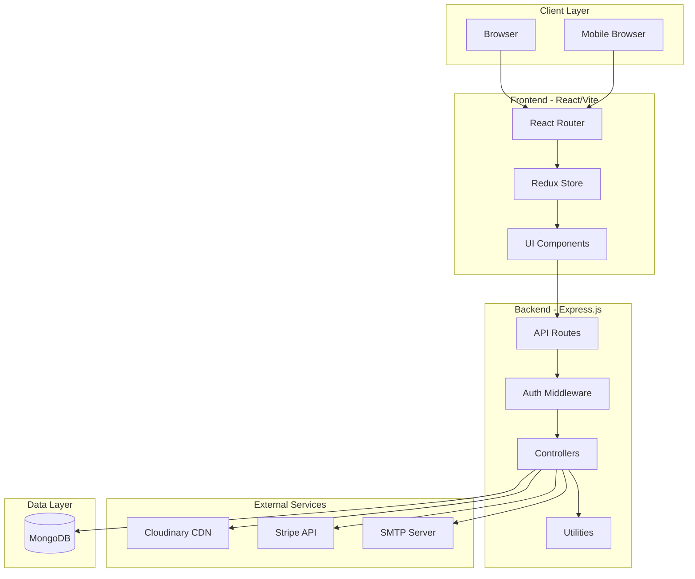
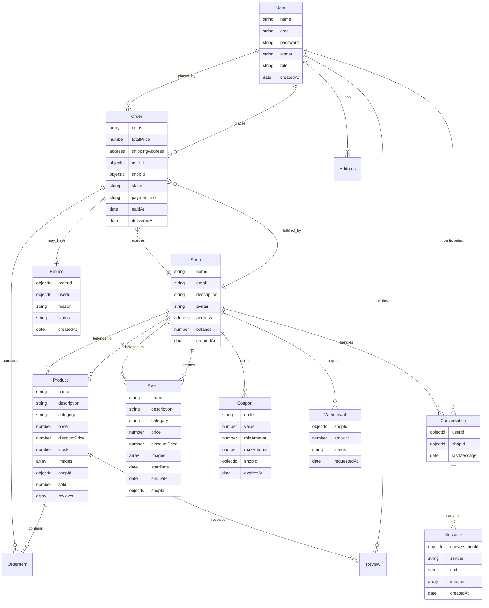
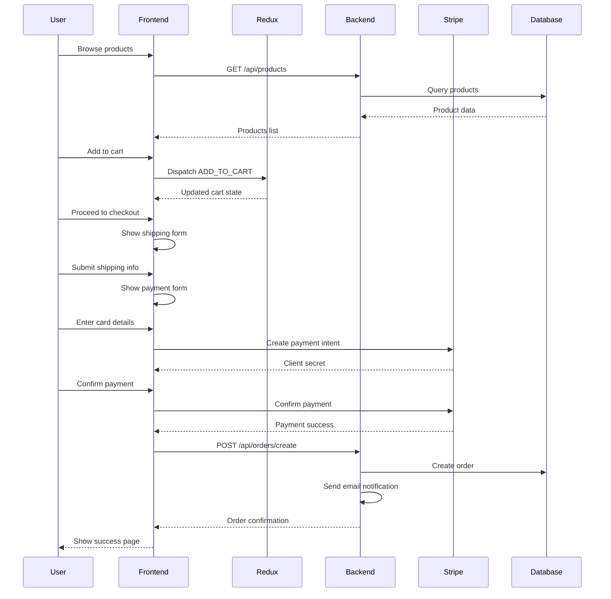
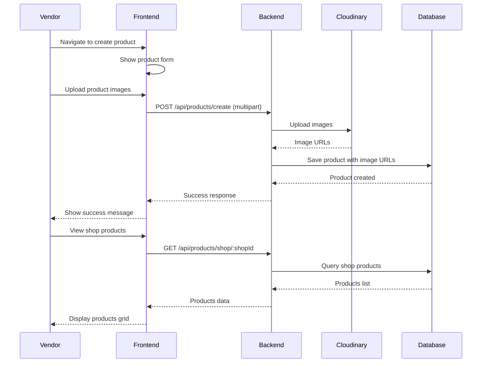

# Vendly Multi-Vendor E-commerce Platform - Case Study

## Project Overview

* **Name:** Vendly Multi-Vendor E-commerce Platform
* **One-liner:** A robust marketplace platform enabling multiple vendors to sell products while providing buyers with a seamless shopping experience across vendors.
* **Repo:** [Your GitHub Repository URL]
* **Demo:** [Your Live Demo URL] (optional)

## Goals of the Project

* Enable multiple vendors to manage their own product catalogs, inventory, and orders independently
* Provide buyers with a unified shopping experience across all vendors
* Implement secure payment processing with Stripe integration
* Build a real-time messaging system for buyer-vendor communication
* Create comprehensive dashboards for vendors, buyers, and administrators
* Support event-based promotions and coupon management
* **Non-goals:** Mobile native applications (web-responsive only), international shipping logistics integration, multi-currency support in v1

## System Architecture Overview

| Layer           | Technology              | Notes                                                                 |
| --------------- | ----------------------- | --------------------------------------------------------------------- |
| Frontend        | React + Vite            | Fast dev experience, component-based UI with hooks                    |
| State Mgmt      | Redux                   | Predictable state management for cart, user, products, orders         |
| Styling         | Tailwind CSS            | Utility-first approach for rapid, consistent UI development           |
| Backend         | Node.js + Express.js    | RESTful API architecture, middleware-based authentication             |
| Database        | MongoDB + Mongoose      | NoSQL flexibility for product variants, vendor schemas                |
| File Storage    | Cloudinary              | Cloud-based image optimization and CDN delivery                       |
| Authentication  | JWT                     | Stateless authentication with httpOnly cookies                        |
| Payments        | Stripe                  | Secure payment processing with webhook support                        |
| Email           | Nodemailer              | Transactional emails for orders, activation, notifications            |
| Realtime        | Socket.io (implied)     | Real-time messaging between buyers and vendors                        |

### Architecture Diagram

## Key Features

### Vendor Management
* Complete shop registration and authentication system
* Product CRUD operations with image uploads
* Inventory tracking and stock management
* Order processing and fulfillment workflow
* Earnings dashboard and withdrawal requests
* Event/promotion creation with time-based scheduling
* Coupon code generation and management
* Real-time inbox for customer communications

### Buyer Experience
* User registration with email activation
* Advanced product browsing with filters and search
* Shopping cart with persistent state
* Wishlist functionality
* Multi-step checkout process with shipping forms
* Order tracking and history
* Address management
* Product reviews and ratings
* Refund request management
* Direct messaging with vendors

### Admin Capabilities
* Platform-wide analytics and monitoring
* Vendor approval and management
* Order oversight and dispute resolution
* Platform settings and configuration

### Core Platform Features
* Responsive design for all device sizes
* Secure authentication with role-based access control (Buyer/Seller/Admin)
* Cloud-based image storage with optimization
* Email notifications for critical events
* Error handling and logging
* Protected routes for authenticated users

## API Architecture

### User Management
* `POST /api/users/register` - User registration
* `POST /api/users/activate` - Email activation
* `POST /api/users/login` - User authentication
* `GET /api/users/profile` - Get user profile
* `PUT /api/users/update` - Update user details
* `POST /api/users/addresses` - Manage shipping addresses

### Shop/Vendor Management
* `POST /api/shops/create` - Shop registration
* `POST /api/shops/login` - Vendor authentication
* `GET /api/shops/:id` - Get shop details
* `PUT /api/shops/update` - Update shop information
* `GET /api/shops/dashboard` - Shop analytics

### Product Management
* `POST /api/products/create` - Create product (seller auth)
* `GET /api/products` - List all products with filters
* `GET /api/products/:id` - Get product details
* `PUT /api/products/:id` - Update product (seller auth)
* `DELETE /api/products/:id` - Delete product (seller auth)
* `GET /api/products/shop/:shopId` - Get shop products

### Event Management
* `POST /api/events/create` - Create promotional event
* `GET /api/events` - List active events
* `GET /api/events/:id` - Get event details
* `PUT /api/events/:id` - Update event
* `DELETE /api/events/:id` - Delete event

### Order Management
* `POST /api/orders/create` - Place order
* `GET /api/orders/user` - Get user orders
* `GET /api/orders/shop` - Get shop orders
* `GET /api/orders/:id` - Get order details
* `PUT /api/orders/:id/status` - Update order status

### Payment Processing
* `POST /api/payments/process` - Process Stripe payment
* `POST /api/payments/webhook` - Stripe webhook handler

### Coupon Management
* `POST /api/coupons/create` - Create coupon
* `GET /api/coupons/shop/:shopId` - Get shop coupons
* `POST /api/coupons/validate` - Validate coupon code
* `DELETE /api/coupons/:id` - Delete coupon

### Refund Management
* `POST /api/refunds/create` - Request refund
* `GET /api/refunds/user` - Get user refunds
* `GET /api/refunds/shop` - Get shop refund requests
* `PUT /api/refunds/:id/status` - Update refund status

### Messaging
* `POST /api/conversations/create` - Start conversation
* `GET /api/conversations` - List user conversations
* `POST /api/messages/send` - Send message
* `GET /api/messages/:conversationId` - Get conversation messages

### Withdrawal Management
* `POST /api/withdrawals/create` - Request withdrawal
* `GET /api/withdrawals/shop` - Get shop withdrawals
* `PUT /api/withdrawals/:id/status` - Process withdrawal (admin)

## Database Design

## Key User Flows

### Buyer Purchase Flow

### Vendor Product Management Flow

## Challenges & Solutions

| Challenge | Solution | Tradeoffs |
| --------- | -------- | --------- |
| **Multi-vendor order management** | Implemented order splitting by vendor at checkout; each vendor receives only their items | Requires coordination for multi-vendor carts; users may receive multiple shipments |
| **Image storage scalability** | Integrated Cloudinary for cloud-based storage with automatic optimization and CDN delivery | External service dependency; API rate limits; costs scale with usage |
| **State management complexity** | Used Redux with organized action/reducer structure for cart, products, orders, and user state | Boilerplate code; learning curve for new developers |
| **Authentication across roles** | JWT-based authentication with role-specific middleware (isAuthenticated, isSellerAuthenticated, isAdmin) | Tokens must be carefully managed; refresh token strategy needed for production |
| **Real-time messaging** | Implemented conversation-based messaging system with polling/WebSocket support | Requires additional infrastructure for WebSocket; state synchronization challenges |
| **Payment security** | Stripe integration with server-side payment processing; never expose API keys on client | Stripe fees; webhook verification required for production |
| **File upload handling** | Multer middleware for multipart/form-data with buffer-based Cloudinary upload | Memory usage concerns for large files; need file size limits |
| **Coupon validation** | Server-side validation with checks for expiry, minimum amount, and usage limits | Race conditions possible; need transaction handling for high-traffic scenarios |

## Best Practices

### Security
* **Password hashing** with bcrypt (salt rounds: 10+)
* **JWT authentication** with httpOnly cookies to prevent XSS attacks
* **Role-based access control** with middleware checks on protected routes
* **Input validation** on both client and server sides
* **CORS configuration** for allowed origins only
* **Rate limiting** on API endpoints to prevent abuse
* **Cloudinary signed uploads** for secure image handling
* **Environment variables** for sensitive credentials (never committed to repo)
* **SQL injection prevention** through Mongoose parameterized queries
* **XSS protection** by sanitizing user inputs

### Performance
* **Redux state optimization** with proper action creators and reducers
* **Image optimization** via Cloudinary transformations (resize, compress, format conversion)
* **Lazy loading** for routes and components
* **Vite HMR** for fast development builds
* **MongoDB indexing** on frequently queried fields (email, shop ID, category)
* **Pagination** for product and order lists
* **Caching strategies** for product catalogs and static assets
* **Debouncing** search inputs to reduce API calls

### Developer Experience
* **Modular architecture** with clear separation of concerns (controllers, models, middleware, utils)
* **Consistent code structure** following MVC pattern
* **Error handling** with centralized error middleware
* **ESLint configuration** for code quality
* **Reusable UI components** (ProductCard, Dialog, Sidebar)
* **Custom hooks** for common logic (useAuth, isMobile)
* **Descriptive naming conventions** for components, functions, and variables
* **README documentation** for setup and usage
* **Git ignore** properly configured for node_modules, env files

### Code Organization
* **Frontend**: Feature-based component structure (Auth, Home, Checkout, Shop, UserDashboard)
* **Backend**: Layered architecture (routes → middleware → controllers → models → database)
* **Shared utilities** for common operations (sendToken, errorHandler, sendEmail)
* **Static data files** for categories, navigation, FAQ content
* **Protected routes** for authenticated user sections

## Conclusion

### Outcomes & Metrics
* Successfully implemented a **full-stack multi-vendor marketplace** with complete CRUD operations for products, orders, and user management
* Built **role-based authentication system** supporting three user types: Buyers, Vendors, and Admins
* Integrated **secure payment processing** with Stripe
* Developed **real-time messaging** system for buyer-vendor communication
* Created **responsive UI** with Tailwind CSS working across devices
* Implemented **cloud-based image management** with Cloudinary
* Established **comprehensive API** with 30+ endpoints covering all platform functionality

### Key Takeaways
* Redux provides excellent state management but requires careful planning to avoid over-complexity
* Cloudinary significantly simplifies image handling and improves performance with CDN delivery
* JWT authentication is effective but requires proper token refresh strategy for production
* Multi-vendor order splitting adds complexity but is essential for marketplace functionality
* Middleware architecture in Express.js enables clean separation of concerns

### Next Steps
* **Add WebSocket support** for real-time order updates and notifications
* **Implement advanced analytics** for vendors (sales trends, popular products, revenue forecasting)
* **Add payment method options** (PayPal, cryptocurrency)
* **Enhance search functionality** with Elasticsearch or Algolia integration
* **Build admin panel** with comprehensive platform management tools
* **Implement automated testing** (Jest, React Testing Library, Supertest)
* **Add internationalization** (i18n) for multi-language support
* **Optimize for SEO** with
